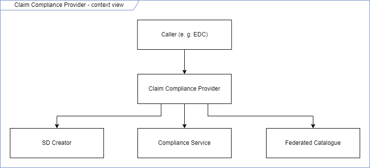
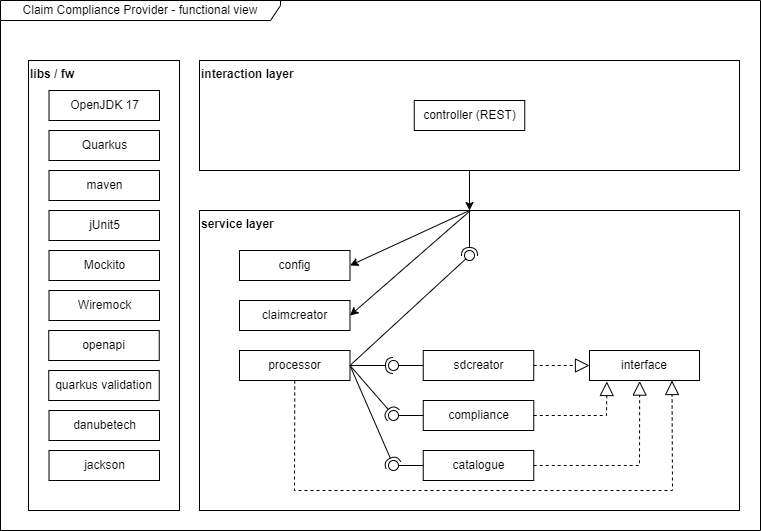
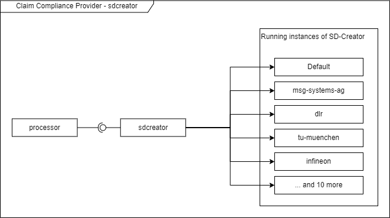
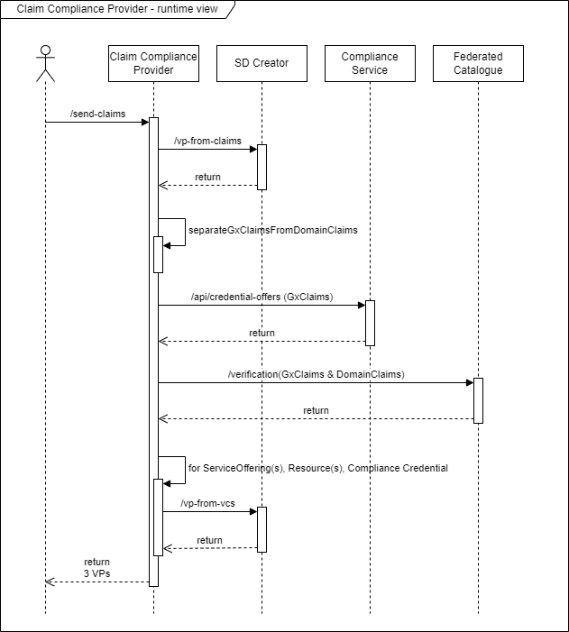

# Architecture of claims compliance provider (CCP)

## Table of Contents
- [Introduction](#introduction)
- [Context view](#context-view)
- [Functional view](#functional-view)
- [Runtime view](#runtime-view)

## Introduction
* This is a short overview of the architecture of the claim compliance provider (CCP).
* All embedded pictures stored in the `pics` directory are created and are **editable** with [draw.io](https://www.drawio.com/).
* Please also have a look into the [API documentation](https://claim-compliance-provider.gxfs.gx4fm.org/docs/) for more details.

## Context view
 

## Functional view

### Overview
The application is designed to be modular. The components are losely coupled and can be replaced by other implementations.
E.g. the signing tool (here `sdcreator`) as well as the whole processing unit (here: `processor`) can be easily replaced.

### Components
- **controller (REST)**: 
  - The REST API is the entry point for the CCP. 
  - It receives claims and the three participant credentials (`LegalParticipant` ,`legalRegistrationNumber`, `GaiaXTermsAndConditions`) and returns signed claims in json format.
  - Interface input validation is done here: payload must not be `null` and both claims and participant credentials must be present and not empty.
- **processor**: 
  - The processor is the core of the CCP. 
  - It has the processing logic and calls the other components via interfaces.
- **sdcreator**: 
  - The current implementation of the signing tool is the [SD-Creator](https://github.com/GAIA-X4PLC-AAD/self-description-creator) and is responsible for signing the claims / VCs / VPs.
  - >Note that there is one instance of SD-Creator per project partner up and running. This component decides along the issuer of the `LegalParticipant` which instance to call:
    > 
    
- **compliance**:
  - The compliance service is responsible for sending the signed GX claims (VCs) along with the three participant credentials described above in a VP to the compliance service.
- **catalogue**:
  - This implementation calls the federated catalogue and is the final destination of the signed claims. 
  - This implementation calls the /verification endpoint of the compliance service to check the validity of both Gaia-X and domain specific claims.
- **interfaces**:
  - The interfaces are used to decouple the components from each other. 
  - The interfaces are implemented by the components and are injected into the processor.
  - This allows to easily replace the components by other implementations.
- **claimcreator**:
  - The claim creator is responsible for creating example claims. 
  - It takes three parameters and returns claims that are already correctly linked together by the generated IDs.
- **config**:
  - Returns important configurations of the components to see especially which URLs of the 3rd party services are connected.

## Runtime view

## Glossary
- CCP: Claim Compliance Provider
- VP: Verifiable Presentation
- VC: Verifiable Credential
- SD: Self Description
- GX: Gaia-X

